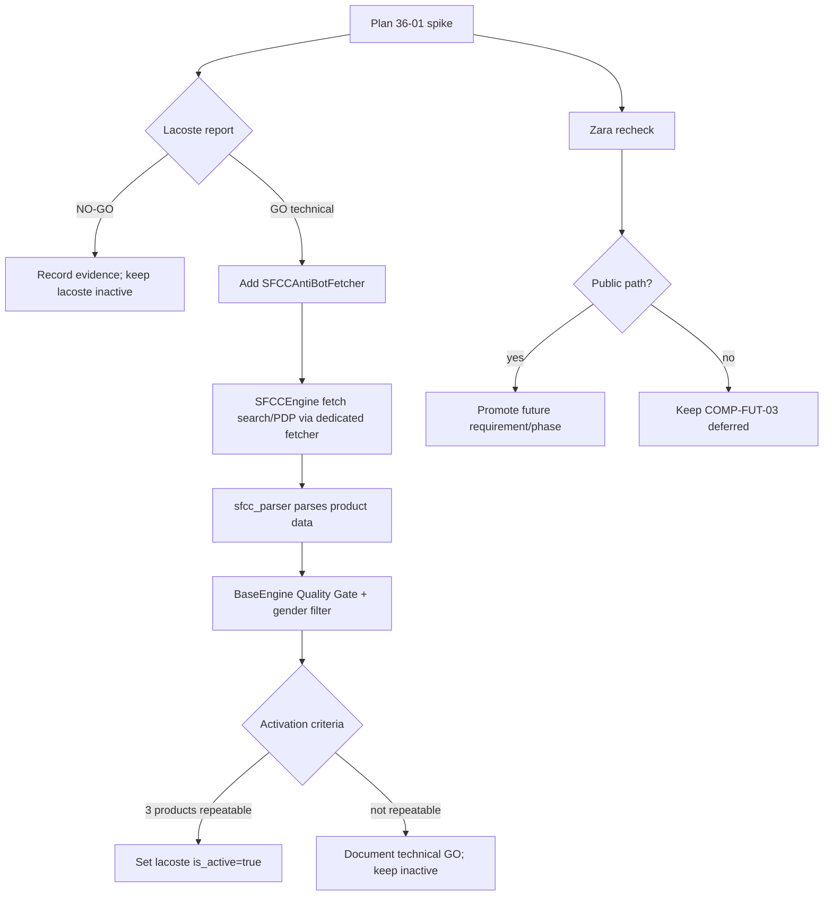

# Phase 36: Onboarding das Marcas Concorrentes Restantes - Lacoste (anti-bot) & Zara - Research

**Researched:** 2026-06-25
**Domain:** Browser-rendered SFCC scraping, anti-bot viability gate, guarded engine integration
**Confidence:** MEDIUM-HIGH

<user_constraints>
## User Constraints (from CONTEXT.md)

### Locked Decisions
- D-01: A phase comeca com um spike isolado e reproduzivel em `.planning/spikes/` com `experiment.py` + `REPORT.md`; veredito explicito GO/NO-GO.
- D-02: Sem nova aprovacao, o unico anti-bot permitido e browser publico mais realista: `playwright-stealth`, contexto/headers/locale/timezone/viewport coerentes, fingerprint masking, baixa frequencia e logging.
- D-03: Proxy residencial, BrightData, ScraperAPI, CAPTCHA solving, browser headed/manual, perfil persistente real ou tecnica de maior custo/risco exige aprovacao posterior.
- D-04: Em NO-GO, registrar evidencia e manter `lacoste.is_active=false`; nao construir engine degradado nem mascarar como "0 produtos".
- D-05: GO tecnico da Lacoste exige >=1 produto real com titulo + URL Lacoste + preco.
- D-06: Ativar a Lacoste exige >=3 produtos reais com titulo + URL Lacoste + preco para `polo` ou fallback `camisa`, e repeticao bem-sucedida.
- D-07: Produto aceito segue contrato `SearchProductResult` e passa pelos Quality Gates/filtro masculino.
- D-08: Shipping SFCC/Lacoste continua `None`.
- D-09: Caminho anti-bot especifico/flagado para SFCC-Lacoste; nao mudar globalmente o `BrowserManager` inicialmente.
- D-10: Preferir wrapper/fetcher dedicado chamado pelo `SFCCEngine` apenas para Lacoste ou flag por marca.
- D-11: Codigo experimental fora de `backend/` ate GO; depois integrar no menor ponto do `SFCCEngine`.
- D-12: Falhas anti-bot em runtime aparecem como `BrandSearchResult.error`, nunca sucesso vazio silencioso.
- D-13: Limites conservadores: `max_results` modesto, baixa concorrencia, sleeps humanos e timeouts claros.
- D-14: Zara e apenas spike de reavaliacao; nao construir engine Zara na Phase 36.
- D-15: Zara viavel promove requisito/fase propria; bloqueada/proprietaria permanece COMP-FUT-03 deferida.
- D-16: Zara serve como controle anti-falso-positivo.

### Codex's Discretion
- Nome exato do spike 008, classes e flags.
- Forma exata do `REPORT.md`, desde que tenha veredito GO/NO-GO e evidencia suficiente.
- Numero de tentativas no gate, respeitando baixa frequencia.
- Local do fetcher dedicado, desde que isolado e testavel.

### Deferred Ideas (OUT OF SCOPE)
- Proxy residencial / BrightData / ScraperAPI / CAPTCHA solving para Lacoste sem aprovacao posterior.
- Engine Zara/Inditex nesta phase.
- Frete/checkout/estoque por CEP para SFCC/Lacoste.
- OCAPI/SCAPI ou endpoint autenticado/comercial.
- Categoria/monitoramento Lacoste alem da busca por termo.
</user_constraints>

<phase_requirements>
## Phase Requirements

| ID | Description | Research Support |
|----|-------------|------------------|
| COMP-03 gap | Lacoste ao vivo via SFCC/public browser; Hugo Boss ja entregue como VTEX. | Gate Lacoste + integracao condicional no `SFCCEngine`. |
| COMP-FUT-03 | Zara/Inditex sem caminho publico validado; reavaliar. | Spike inclui Zara como controle e reporta promover/deferir. |
</phase_requirements>

## Summary

Phase 36 should be planned like Phase 32: a Wave 0 gate produces empirical evidence before production code. The current code already has `SFCCEngine`, parser and factory wiring; the gap is transport viability for Lacoste BR. The correct first artifact is a spike under `.planning/spikes/008-lacoste-antibot-zara-recheck/`, not a backend edit.

`playwright-stealth` is already installed locally at 2.0.3 and PyPI reports 2.0.3 as latest. Its local API exposes `Stealth().apply_stealth_sync(page_or_context)` and `apply_stealth_async(page_or_context)`. The PyPI page documents applying stealth to an entire context and notes persistent context support as a TODO, so Phase 36 should avoid persistent real profiles under the current permission envelope.

**Primary recommendation:** Wave 0 creates and runs a public-browser spike with baseline + stealth Lacoste probes and Zara recheck. Only if the report returns GO should Wave 1 add a dedicated `SFCCAntiBotFetcher` and wire it to `SFCCEngine` behind a Lacoste/flag check.

## Architectural Responsibility Map

| Capability | Primary Tier | Secondary Tier | Rationale |
|------------|--------------|----------------|-----------|
| Lacoste viability probe | Planning/spike | Backend engine patterns | External live behavior must be proven outside `backend/` before production integration. |
| Lacoste anti-bot fetch | Backend service/engine | Core browser utility | Fetching rendered HTML for search/PDP belongs near `SFCCEngine`; shared `BrowserManager` should not change globally. |
| Product parsing/validation | Backend service | Core models | Existing `sfcc_parser.py`, `BaseEngine.validate_single`, `SearchProductResult` already own the contract. |
| Brand activation | Backend data/config | Planning evidence | `brands.json` controls active search inclusion through `list_brands(active_only=True)`. |
| Zara decision | Planning/spike | Roadmap requirements | The output is promote/defer, not production code. |

## Standard Stack

### Core

| Library | Version | Purpose | Why Standard |
|---------|---------|---------|--------------|
| `playwright` | 1.58.0 installed | Browser rendering for SFCC search/PDP. | Existing project dependency and `BrowserManager` base. |
| `playwright-stealth` | 2.0.3 installed/latest | Apply stealth init scripts to page/context in the spike/fetcher. | Already in `backend/requirements.txt`; local API verified. |
| `beautifulsoup4` | 4.14.3 installed | Parse rendered HTML in existing SFCC parser/spike diagnostics. | Existing parser dependency. |
| `pytest` | 9.0.3 installed | Hermetic tests for fetcher and engine routing. | Existing backend test framework. |

### Supporting

| Library | Version | Purpose | When to Use |
|---------|---------|---------|-------------|
| `curl_cffi` | 0.15.0 installed | Baseline HTTP/impersonation probe only. | Useful for documenting current 403; not the production Lacoste path. |

### Alternatives Considered

| Instead of | Could Use | Tradeoff |
|------------|-----------|----------|
| Dedicated SFCC-Lacoste fetcher | Global `BrowserManager` stealth rewrite | Simpler call sites but higher regression risk for banners, detection, Amazon and Mercado Livre. |
| Stealth context | Persistent real browser profile | PyPI notes persistent-context support as unfinished; also outside D-03 without approval. |
| Direct proxy integration | BrightData/ScraperAPI | Existing infra exists, but D-03 forbids use without approval. |

**Installation:** No new packages. `playwright-stealth` is already present.

## Package Legitimacy Audit

No external package installs are planned. `playwright-stealth` exists in `backend/requirements.txt`, is installed locally at 2.0.3, and `pip index versions playwright-stealth` reports latest 2.0.3. No slopcheck gate needed because no new package is added.

## Architecture Patterns

### System Architecture Diagram



### Recommended Project Structure

```text
.planning/spikes/008-lacoste-antibot-zara-recheck/
  experiment.py       # live evidence gate, outside backend until GO
  REPORT.md           # GO/NO-GO + Lacoste/Zara evidence
backend/services/engines/
  sfcc_antibot_fetcher.py  # conditional GO artifact
  sfcc_engine.py           # minimal wiring to fetcher for Lacoste/flag
backend/tests/
  test_sfcc_antibot_fetcher.py
  test_sfcc_engine.py      # extended routing/error tests
```

### Pattern 1: Spike Gate Before Production Code

Use Phase 32's Wake pattern: isolated `experiment.py` + explicit `REPORT.md` with GO/NO-GO. For Phase 36, GO is split into technical GO (>=1 product) and activation GO (>=3 products repeatable).

### Pattern 2: Dedicated Fetcher, Not Global BrowserManager Rewrite

Keep `BrowserManager.fetch_html` unchanged. Create a brand/flag-specific fetcher that mirrors BrowserManager's `asyncio.to_thread(_sync_fetch)` structure, applies `Stealth().apply_stealth_sync(context)` or `page`, and returns HTML plus diagnostics. Wire only Lacoste/SFCC calls through it after GO.

### Pattern 3: Errors as Data

`SFCCEngine.search` already catches search-page fetch exceptions and returns `BrandSearchResult.error`. The anti-bot fetcher should raise diagnostic exceptions or return structured failure info that `SFCCEngine` converts into `BrandSearchResult.error`, never an empty success.

## Don't Hand-Roll

| Problem | Don't Build | Use Instead | Why |
|---------|-------------|-------------|-----|
| Browser stealth scripts | Custom JS patch collection | `playwright-stealth` | Already installed; avoids one-off fingerprint patches. |
| Product parsing | New parser in fetcher | Existing `sfcc_parser.py` | Keeps fetch separate from parse/validation. |
| Product schema | Dicts returned directly | `SearchProductResult` + Quality Gates | Existing contract prevents partial/corrupt products. |
| Zara production integration | New Inditex engine | Spike report only | Context D-14 forbids engine build in this phase. |

## Common Pitfalls

### Pitfall 1: Treating "stealth loaded" as GO
**What goes wrong:** The spike applies stealth but returns only Access Denied HTML.
**How to avoid:** GO requires product data, not navigation success.

### Pitfall 2: Global BrowserManager regression
**What goes wrong:** Changing all Playwright consumers changes banner extraction/detection behavior.
**How to avoid:** Add a dedicated fetcher and wire only Lacoste/SFCC behind a flag.

### Pitfall 3: Silent empty success
**What goes wrong:** Anti-bot returns 296B Access Denied and parser yields zero products.
**How to avoid:** Detect block signatures/short HTML and surface `BrandSearchResult.error`.

### Pitfall 4: Activating on weak evidence
**What goes wrong:** `lacoste.is_active=true` after one fragile product.
**How to avoid:** D-06 requires >=3 products and repeatability before activation.

### Pitfall 5: Scope creep via Zara
**What goes wrong:** The recheck becomes an Inditex engine.
**How to avoid:** REPORT only says promote/defer; engine belongs to a later phase.

## Code Examples

### Local `playwright-stealth` API

Verified locally:

```python
from playwright_stealth import Stealth

Stealth().apply_stealth_sync(page_or_context)
Stealth().apply_stealth_async(page_or_context)
```

### Existing Amazon stealth usage

`backend/services/engines/amazon_engine.py` imports `Stealth` and applies it to a Playwright page inside a try/except. Phase 36 should copy the error-tolerant application style but apply it in a dedicated SFCC fetcher.

## Assumptions Log

| # | Claim | Section | Risk if Wrong |
|---|-------|---------|---------------|
| A1 | Lacoste may pass with public stealth context and low frequency. | Summary | If wrong, gate returns NO-GO and backend integration is skipped. |
| A2 | Existing SFCC parser remains sufficient once HTML is fetched. | Patterns | If Lacoste HTML differs, Plan 02 must extend parser tests before activation. |

## Open Questions (RESOLVED)

1. **Use proxy/gateway?** RESOLVED: No; D-03 requires later explicit approval.
2. **Activate after one product?** RESOLVED: No; D-06 requires >=3 repeatable products.
3. **Modify global BrowserManager?** RESOLVED: No; D-09 requires specific/flagged path.
4. **Build Zara engine?** RESOLVED: No; D-14 makes Zara a recheck only.

## Environment Availability

| Dependency | Required By | Available | Version | Fallback |
|------------|-------------|-----------|---------|----------|
| Python | Backend scripts/tests | yes | 3.14.3 | none |
| pytest | Hermetic tests | yes | 9.0.3 | none |
| playwright | Browser rendering | yes | 1.58.0 | none |
| playwright-stealth | Stealth fetcher/spike | yes | 2.0.3 | NO-GO if ineffective |
| beautifulsoup4 | HTML diagnostics/parsing | yes | 4.14.3 | existing parser |
| gsd-tools CLI | Workflow validation | no | - | local structural validation |

**Missing dependencies with no fallback:** none for planned implementation.
**Missing dependencies with fallback:** `gsd-tools` not on PATH; use local checks for file/structure validation.

## Validation Architecture

### Test Framework

| Property | Value |
|----------|-------|
| Framework | pytest 9.0.3 |
| Config file | `pytest.ini` |
| Quick run command | `python -m pytest backend/tests/test_sfcc_antibot_fetcher.py backend/tests/test_sfcc_engine.py -q --tb=short` |
| Full suite command | `python -m pytest backend/tests/ -q` |

### Phase Requirements -> Test Map

| Req ID | Behavior | Test Type | Automated Command | File Exists? |
|--------|----------|-----------|-------------------|--------------|
| COMP-03 gap | Lacoste gate report GO/NO-GO before backend code | live spike | `python .planning/spikes/008-lacoste-antibot-zara-recheck/experiment.py` | Wave 0 |
| COMP-03 gap | Anti-bot fetcher applies stealth and reports block signatures | unit | `python -m pytest backend/tests/test_sfcc_antibot_fetcher.py -q` | Wave 1 |
| COMP-03 gap | SFCCEngine uses dedicated fetcher only for Lacoste/flag and returns errors diagnostically | unit | `python -m pytest backend/tests/test_sfcc_engine.py -q` | Exists, extend Wave 1 |
| COMP-FUT-03 | Zara public path promoted/deferred in REPORT | live spike | `python -c "import pathlib; t=pathlib.Path('.planning/spikes/008-lacoste-antibot-zara-recheck/REPORT.md').read_text(encoding='utf-8'); assert '## Zara' in t"` | Wave 0 |

### Sampling Rate

- Per task: quick command for changed tests.
- Per wave: `python -m pytest backend/tests/ -q`.
- Phase gate: full suite green plus live Lacoste smoke only if activation GO.

### Wave 0 Gaps

- `.planning/spikes/008-lacoste-antibot-zara-recheck/experiment.py`
- `.planning/spikes/008-lacoste-antibot-zara-recheck/REPORT.md`
- `backend/tests/test_sfcc_antibot_fetcher.py` (created after GO)

## Security Domain

### Applicable ASVS Categories

| ASVS Category | Applies | Standard Control |
|---------------|---------|------------------|
| V2 Authentication | no | No login/account flow in scope. |
| V3 Session Management | no | Persistent user profiles out of scope. |
| V4 Access Control | no | No protected backend endpoint added. |
| V5 Input Validation | yes | URL/query encoding, fixed target domains, Quality Gates. |
| V6 Cryptography | no | No crypto changes. |

### Known Threat Patterns

| Pattern | STRIDE | Standard Mitigation |
|---------|--------|---------------------|
| Anti-bot block mistaken for no products | Tampering/DoS | Detect block signatures, return `BrandSearchResult.error`. |
| Scope escalation to proxy/CAPTCHA | Elevation of privilege/cost risk | D-03 gate; plans forbid proxy/gateway without approval. |
| Token/profile leakage | Information disclosure | No persistent real profile; no private credentials in scope. |
| Global browser behavior drift | Tampering/regression | Dedicated fetcher and hermetic tests. |

## Sources

### Primary (HIGH confidence)
- PyPI `playwright-stealth` - version 2.0.3, context/page apply API examples, upload metadata: https://pypi.org/project/playwright-stealth/
- Playwright Python Network docs - proxy capabilities (documented but out of scope by D-03): https://playwright.dev/python/docs/network
- Playwright Python BrowserContext docs - context isolation/cookies: https://playwright.dev/python/docs/api/class-browsercontext
- Local package inspection - `Stealth.apply_stealth_sync` / `apply_stealth_async` signatures.

### Project Sources (HIGH confidence)
- `36-CONTEXT.md`, `31-CONTEXT.md`, `32-CONTEXT.md`, `sfcc_engine.py`, `browser_manager.py`, `amazon_engine.py`, `brands.json`.

## Metadata

**Confidence breakdown:**
- Standard stack: HIGH - local versions and PyPI verified.
- Architecture: HIGH - based on existing SFCC/Wake patterns.
- Pitfalls: MEDIUM-HIGH - based on prior local failures plus known Playwright/stealth constraints.

**Research date:** 2026-06-25
**Valid until:** 2026-07-02 for live anti-bot behavior; 2026-07-25 for local code patterns.
